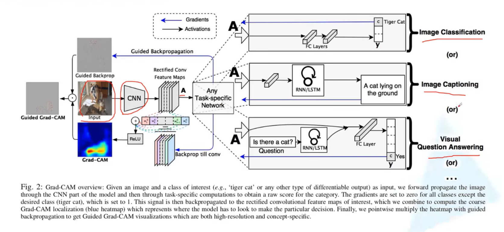
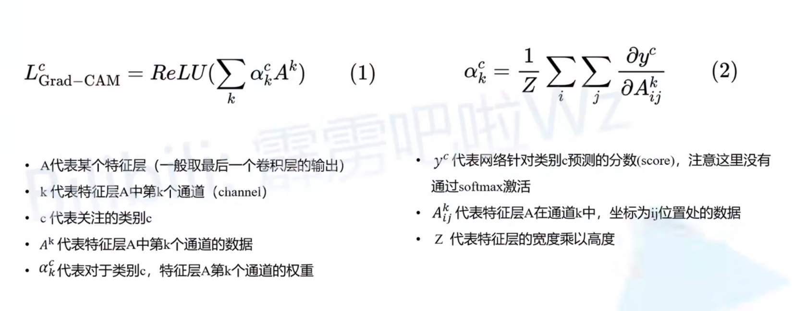
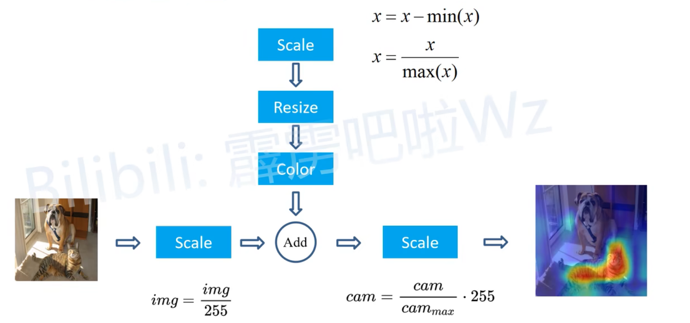

## Grad-CAM
- Original Impl: [https://github.com/jacobgil/pytorch-grad-cam](https://github.com/jacobgil/pytorch-grad-cam)
- Grad-CAM简介: [https://b23.tv/1kccjmb](https://b23.tv/1kccjmb)
- 使用Pytorch实现Grad-CAM并绘制热力图: [https://b23.tv/n1e60vN](https://b23.tv/n1e60vN)

## 使用流程(替换成自己的网络)
1. 将创建模型部分代码替换成自己创建模型的代码，并载入自己训练好的权重
2. 根据自己网络设置合适的`target_layers`
3. 根据自己的网络设置合适的预处理方法
4. 将要预测的图片路径赋值给`img_path`
5. 将感兴趣的类别id赋值给`target_category`

## Grad-CAM原理
1. 相比于CAM，Grad-CAM不用修改原有网络即可查看网络的注意力
2. 可以用于观察网络是否有‘偏见’(性别、年龄、肤色等)，比如区分医生护士应该关注于服装、器械，而不是性别，可以据此修改数据集
3. 网络架构

给定一张图像和一个感兴趣的类(例如，“虎猫”或任何其他类型的可微输出)作为输入，我们通过模型的CNN部分向前传播图像，然后通过特定于任务的计算来获得该类别的原始得分(没有softmax的网络输出)。 
所有类的梯度都被设置为0，除了所需的类(老虎猫)，它被设置为1/-1。然后，该信号反向传播到感兴趣的校正卷积特征图，我们将其组合起来(加权求和，ReLU)计算粗略的Grad-CAM定位(单通道蓝色热图)，该热图表示模型必须在哪里进行特定决策。
最后，我们将热图与导向反向传播(Guided Backprop)逐点相乘，以获得既高分辨率又特定于概念的导向Grad-CAM(Guided Grad-CAM)可视化。
4. 一般使用的是最后一层'卷积层'(注意)的特征图，但是也可以使用中间层的特征图，这样可以观察到更细粒度的特征
5. 加权求和部分的公式表示

6. 后处理，将蓝色热图和原图叠加

介绍博客：https://blog.csdn.net/qq_37541097/article/details/123089851